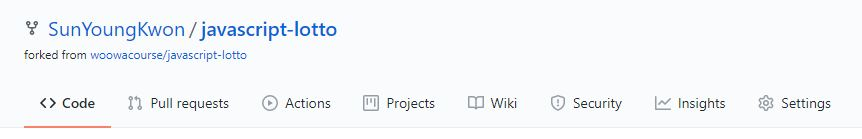
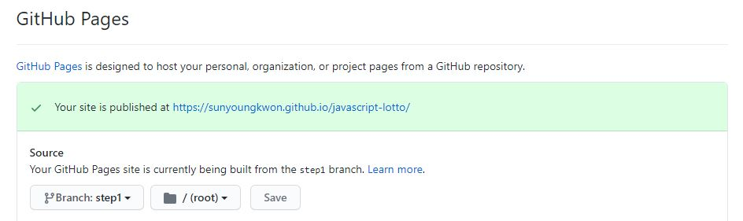
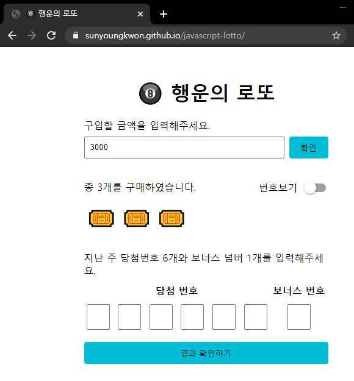

# Github Page로 데모 만들기

## 01. 저장소의 Settings로 이동

## 02. GirHub Pages > Source에서 데모로 만들고 싶은 코드(브랜치) 선택

## 03. `https://{github_username}.github.io/{repository_name}/`으로 접속

---

[[TOP]](#github-page로-데모-만들기) | [[HOME]](https://github.com/SunYoungKwon/Sun-Woowa.log#-what-i-studied-in-woowacourse)
