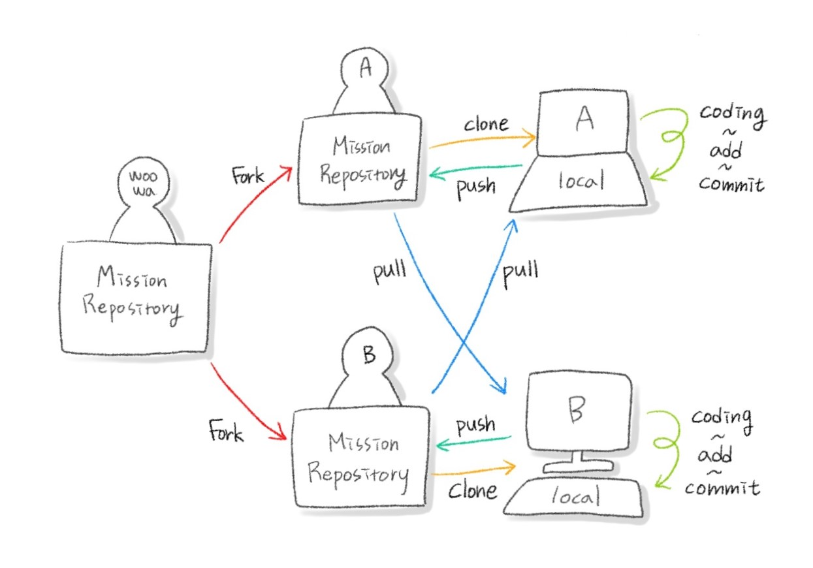

# 페어프로그래밍하며 각자 계정으로 커밋로그 찍기

1. 각자의 계정으로 미션 저장소 Fork
2. A ➡ 본인의 로컬에 Fork한 저장소를 clone `git clone 'A의 저장소주소'`
3. B ➡ 본인의 로컬에 Fork한 저장소를 clone `git clone 'B의 저장소주소'`
4. A ➡ 로컬에서 코드를 작성하고 커밋
5. A ➡ 로컬에서 작업한 내용을 본인의 저장소로 push `git push origin 'A의 미션 브랜치'`
6. B ➡ A의 저장소를 remote로 등록 `git remote add pair 'A의 저장소주소'`
7. B ➡ A가 작업한 내용 가져오기 `git pull pair 'A의 미션 브랜치'`
8. B ➡ 로컬에서 코드를 작성하고 커밋
9. B ➡ 로컬에서 작업한 내용을 본인의 저장소로 push `git push origin 'B의 미션 브랜치'`
10. A ➡ B의 저장소를 remote로 등록 `git remote add pair 'B의 저장소주소'`
11. A ➡ B가 작업한 내용 가져오기 `git pull pair 'B의 미션 브랜치'`
12. 4 ~ 11 반복

---

[[TOP]](#페어프로그래밍하며-각자-계정으로-커밋로그-찍기) | [[HOME]](https://github.com/SunYoungKwon/Sun-Woowa.log#-what-i-studied-in-woowacourse)
