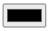
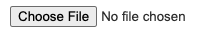
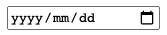
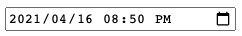
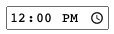
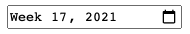
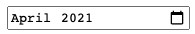

# input

## input태그의 type과 attribute

|      type      | description                                                                                                                                                                                                   |                              특정한 attribute                               |
| :------------: | :------------------------------------------------------------------------------------------------------------------------------------------------------------------------------------------------------------ | :-------------------------------------------------------------------------: |
|      text      | 기본 값. 한 줄 짜리 텍스트필드이며 줄바꿈을 자동으로 제거함.                                                                                                                                                  |          dirname, pattern, placeholder, size, maxlength, minlength          |
|     number     | spinner이 나타남. 다이나믹 키보드를 지원하는 기기라면 숫자 키패드를 보여줌.                                                                                                                                   |                                  min, step                                  |
|      tel       | 전화번호 입력창. 다이나믹 키보드를 지원하는 기기에서는 전화번호 키패드를 보여줌.                                                                                                                              |              pattern, placeholder, size, maxlength, minlength               |
|     email      | text처럼 보이지만, 유효성 검사와 다이나믹 키보드를 지원하는 브라우저나 기기에서 적절한 키패드를 보여주는 기능이 있음.                                                                                         |                               multiple, size                                |
|    password    | 입력된 값이 숨김처리되는 한 줄 짜리 텍스트필드. 보안되지 않은 사이트라면 사용자에게 경고함.                                                                                                                   |              maxlength, minlength, pattern, placeholder, size               |
|     search     | 검색어를 입력할 수 있는 한 줄 짜리 텍스트필드로 줄바꿈이 자동으로 삭제됨. 브라우저에 따라 입력된 값을 지울 수 있는 삭제 아이콘이 나타날 수 있음. 일부 기기의 다이나믹 키보드에서 enter키 대신 검색 버튼을 줌. |                 dirname, maxlength, minlength, placeholder                  |
|      url       | text처럼 보이지만, 유효성 검사와 다이나믹 키보드를 지원하는 브라우저나 기기에서 적절한 키패드를 보여주는 기능이 있음.                                                                                         |                      maxlength, minlength, placeholder                      |
|     reset      | 연결된 form 내의 입력창 값을 default value로 바꿔줌.                                                                                                                                                          |
|     button     | value 값이 버튼에 텍스트로 들어감.                                                                                                                                                                            |
|     submit     | form 제출을 위한 버튼.                                                                                                                                                                                        |       formaction, formenctype, formmethod, formnovalidate, formtarget       |
|     image      | 그래픽적인 submit 버튼을 만들 수 있음. src가 유효하지 않으면 alt 문자가 나타남.                                                                                                                               | width, alt, formaction, formenctype, formmethod, formnovalidate, formtarget |
|    checkbox    | 체크박스                                                                                                                                                                                                      |                                   checked                                   |
|     radio      | 중복 체크가 불가능한 라디오박스                                                                                                                                                                               |                                   checked                                   |
|     hidden     | 화면에 나타나진 않지만, submit 시 값을 서버로 보낼 수 있음.                                                                                                                                                   |
|     range      |                                                                                                                                                                                      |
|     color      |                                                                                                                                                                                      |
|      file      |                                                                                                                                                                                        |                          accept, capture, multiple                          |
|      date      |                                                                                                                                                                                      |                                                                             |
| datetime-local |                                                                                                                                                                  |                                                                             |
|      time      |                                                                                                                                                                                      |                                                                             |
|      week      |                                                                                                                                                                                      |                                                                             |
|     month      |                                                                                                                                                                                    |                                                                             |

### 공통 attribute

- type
- value
- name
- disabled
- form
- autocomplete
- autofocus

## 링크

- [[MDN] Input element](https://developer.mozilla.org/en-US/docs/Web/HTML/Element/input)

---

[[TOP]](#input) | [[HOME]](https://github.com/SunYoungKwon/Sun-Woowa.log#-what-i-studied-in-woowacourse)
