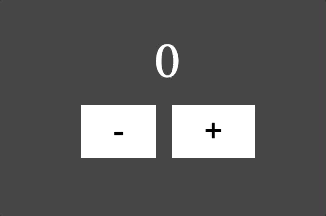

# redux

## redux의 원칙

### 1. 하나의 앱에 하나의 store

- 앱 전체에 대한 상태가 하나의 객체에 담겨있다.
- 상태가 담긴 객체를 state 또는 state tree라고 부른다.

### 2. 상태는 read only

- 상태는 직접 수정하거나 덮어쓸 수 없다.
- 상태를 변경하는 유일한 방법은 `action`을 `dispatch`하는 것이다.
  - `action`은 변경에 대한 정보를 가진 객체이며, `type` 프로퍼티를 가진다.
  - `type` 프로퍼티의 값은 식별가능한 문자열이다.

### 3. Reducer는 순수함수

- 이전 상태 → `action`을 `dispatch` → 새로운 상태
- 위 과정에서 `action에` 따른 새로운 상태를 만들어 줄 함수를 `Reducer`라고 한다.
- `Reducer`는 기존 상태를 수정하는 것이 아니라 새로운 값을 반환한다.
- 아래와 같은 상태에서 `filter`의 값을 변경하는 경우, `todos`까지 새로 만들지 않는다. `todos`는 주소를 참조하고 있기 때문이다. 이와 같은 이유로 Redux는 빠르게 동작할 수 있다.
  ```javascript
  {
    todos: [
      {id: 0, text: 'Redux 강의듣기', isCompleted: true},
      {id: 1, text: '오늘의 TIL 작성하기', isCompleted: false}
    ],
    filter: "ACTIVE"
  }
  ```

#### 순수함수

- 사이드이펙트가 없음
- 반환값이 넘겨받은 인수에 의존적
- 넘겨받은 인수를 변경하지 않음

## 실습

### Counter



## 참고

- [Fundamentals of Redux Course from Dan Abramov](https://egghead.io/courses/fundamentals-of-redux-course-from-dan-abramov-bd5cc867)

---

[[TOP]](./#Redux) | [[HOME]](https://github.com/SunYoungKwon/What-I-Studied-on-Woowacourse#-what-i-studied-on-woowacourse)
