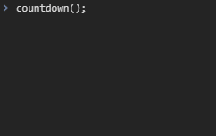

# Promise

`Promise`는 비동기 작업의 최종 완료 또는 실패를 나타내는 객체이다.

## Keywords

- Promise
- then()
- async-await
- 비동기

## 사용 예시

### 내용

각 1초의 간격으로 3 -> 2 -> 1 -> '출발!'을 차례로 콘솔창에 나타내기

### 구현 결과



### setInterval과 setTimeout 사용하기

```javascript
const printCountdown = (countStart) => {
  return new Promise((resolve) => {
    let count = countStart;

    const timeoutId = setInterval(() => {
      console.log(count);
      count = count - 1;

      if (count === 0) {
        clearInterval(timeoutId);
        resolve();
      }
    }, 1000);
  });
};

const printMessage = () => {
  return new Promise((resolve) => {
    setTimeout(() => {
      console.log('출발!');
      resolve();
    }, 1000);
  });
};

const countdown = async () => {
  await printCountdown(3);
  await printMessage();
};

countdown();

printCountdown(3).then(printMessage); // countdown()과 같은 동작
```

### 재사용 가능하게 수정

```javascript
const sleep = (ms) => {
  return new Promise((resolve) => setTimeout(resolve, ms));
};

const countdown = async () => {
  await sleep(1000);
  console.log(3);
  await sleep(1000);
  console.log(2);
  await sleep(1000);
  console.log(1);
  await sleep(1000);
  console.log('출발!');
};

countdown();
```

## 참고자료

- [MDN - Promise](https://developer.mozilla.org/ko/docs/Web/JavaScript/Reference/Global_Objects/Promise)
