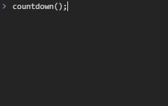

# Promise

`Promise`는 비동기 작업의 최종 완료 또는 실패를 나타내는 객체이다.

## Keywords

- Promise
- then()
- async-await
- 비동기

## 사용 예시

### 내용

각 1초의 간격으로 3 -> 2 -> 1 -> '출발!'을 차례로 콘솔창에 나타내기

### 구현 결과



### setInterval과 setTimeout 사용하기

```javascript
const printCountdown = (countStart) => {
  return new Promise((resolve) => {
    let count = countStart;

    const timeoutId = setInterval(() => {
      console.log(count);
      count = count - 1;

      if (count === 0) {
        clearInterval(timeoutId);
        resolve();
      }
    }, 1000);
  });
};

const printMessage = () => {
  return new Promise((resolve) => {
    setTimeout(() => {
      console.log('출발!');
      resolve();
    }, 1000);
  });
};

const countdown = async () => {
  await printCountdown(3);
  await printMessage();
};

countdown();

printCountdown(3).then(printMessage); // countdown()과 같은 동작
```

### 주어진 시간만큼 시간을 지연시키는 sleep()을 만든다면?

```javascript
const sleep = (ms) => {
  return new Promise((resolve) => setTimeout(resolve, ms));
};

const countdown = async () => {
  await sleep(1000);
  console.log(3);
  await sleep(1000);
  console.log(2);
  await sleep(1000);
  console.log(1);
  await sleep(1000);
  console.log('출발!');
};

countdown();
```

- 실제 프로젝트를 하며 위와 같은 코드를 짤 일은 거의 없다.
- 비동기는 미래에 할 일에 대해 약속을 하는 것인데, 위와 같은 코드는 그저 시간을 지연시키기만 한다. 예를 들어, 카페에서 주문을 하면 미래에 커피를 만들어 줄 것을 약속하고 진동벨(**Promise 객체**)을 준다. 이때, 주어진 시간만큼 기다리면 커피를 받을 수도 있고(**resolve()**), 재료 소진등의 이유로 받지 못 할 수도(**reject()**) 있다. 어찌되었든, 지연되는 시간은 커피가 만들어지길 기다리기 위함이다. 하지만 위와 같은 코드를 짜는 것은 주문을 하기 전에 일단 진동벨을 들고가서 기다리는 것과 같다. 의미없이 시간을 버리는 것이다.
- 만약 카운트 시작을 5부터 하고싶다면? -> 매번 하드코딩 해야한다. 결국 코드에 `sleep()`이 매우 많아질 것

## 참고자료

- [MDN - Promise](https://developer.mozilla.org/ko/docs/Web/JavaScript/Reference/Global_Objects/Promise)
