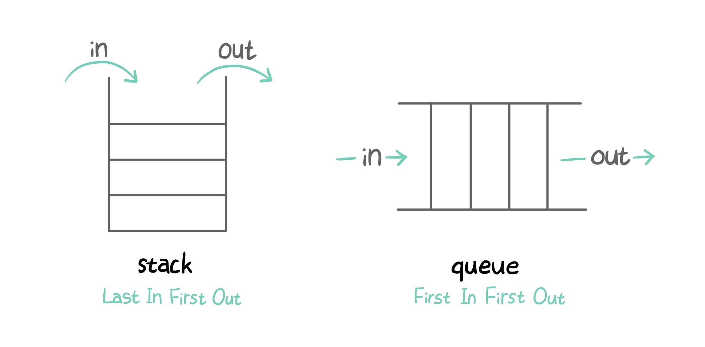
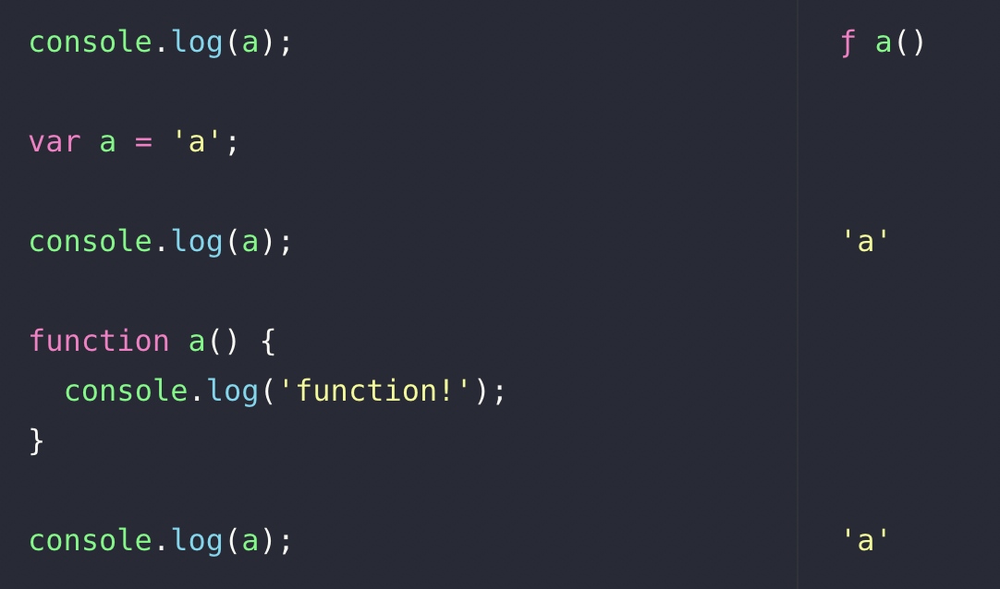

# 실행 컨텍스트

## 실행 컨텍스트(execution context)란?

실행 가능한 코드가 실행될 때 제공할 환경 정보들을 모아놓은 **객체**

### 실행 가능한 코드란?

1. 전역 공간의 코드
2. eval()
3. 함수 호출

현재 실행중인 코드와 관련없는 코드가 실행되면(예. 새로운 함수 호출) 새로운 컨텍스트를 생성하고 콜스택에 쌓는다. 실행중이던 코드가 종료되면 해당 컨텍스트가 제거되고, 최 상위에 올라온 실행 컨텍스트와 관련된 코드를 마저 실행한다. JS는 콜스택을 이용하여 전체 코드의 환경과 순서를 보장한다.

전역 컨텍스트는 콜스택의 가장 하위에 존재한다.브라우저가 자동으로 실행하며, 앱이 종료될 때까지 유지된다.

#### 스택 vs 큐

<p style="text-align: center;">
  
</p>

- 스택: 후입선출(LIFO: Last In First Out)
- 큐: 선입선출(FIFO: First In First Out)

## 실행 컨텍스트가 가지는 정보

### Variable Environment

- 식별자 + 외부 환경 정보
  - 변수명
  - 매개변수와 인수
  - 함수 선언(표현식 제외)
- 선언시점의 Lexical Environment의 스냅샷으로 변경을 반영하지 않음

#### 객체 생성 순서(key: value)

1. 매개변수: 인수
2. 함수명: 함수
3. 변수명: undefined

<p style="text-align: center;">
  
</p>

함수 선언을 먼저 처리한 후에 변수 선언을 처리하기 때문에, 코드상 함수 a가 나중에 선언되었으나 마지막 `console.log(a)`의 결과는 함수가 아닌 변수 a의 값이 된다.

### Lexical Environment

- Variable Environment를 복사해서 생성
- 변경이 실시간 반영됨

#### environmentRecord

- 전역 실행 컨텍스트는 전역 객체 사용
- 식별자 정보 저장(변수는 선언만 저장하고 할당은 저장하지 않음)
- 순서대로 수집(위의 객체 생성 순서 참조)
- 수집을 마친 시점은 아직 코드가 실행되기 전
  - 코드가 실행되기 전에 식별자 정보를 저장해 둔 것이 **호이스팅**의 정체!

#### outerEnvironmentReference

- 전역 컨텍스트는 아무 값도 가지지 않음
- 함수가 **선언될 당시**의 Lexical Environment 참조
- 연결 리스트(linked list)
- 스코프: 식별자에 대한 유효범위
  - ES5까지는 전부 함수 스코프
  - let, const, class, 엄격 모드에선 블록 스코프
- 스코프체인: 스코프를 안에서 밖으로 차례로 객체의 프로퍼티가 아닌(전역 객체 제외) 식별자를 검색해 나가는 것
  - (비교) 프로토타입체인: 객체의 프로퍼티(메소드 포함)를 검색하는 메커니즘

#### 함수 선언문 vs 함수 표현식

- 함수 선언문: `function a() {}`
  - 반드시 기명함수
- 함수 표현식: `var a = function() {}`

  - 함수를 값으로 할당
  - 익명함수도 사용 가능(과거 브라우저는 익명함수를 사용할 경우 디버깅 시 함수 이름을 표시해주지 않았다. 하지만 지금은 잘 나옴.)
  - 호이스팅은 선언만!

  ```javascript
  var c = function d() {};

  c(); // ok
  d(); // error
  ```

- 호이스팅으로 인한 혼란을 방지하기 위해 **함수 표현식**을 사용하는 것이 좋다!

### This Binding

- this 식별자 대상 객체
- 실행 컨텍스트를 활성화하는 당시 지정된 this 저장
- this는 함수 호출 패턴에 따라 달라진다

## 참고

- [코어자바스트립트 - 정재남 저] Chapter2. 실행 컨텍스트
- [실행컨텍스트와 자바스크립트의 동작 원리](https://poiemaweb.com/js-execution-context)

---

[[TOP]](#실행-컨텍스트) | [[HOME]](https://github.com/SunYoungKwon/Sun-Woowa.log#-what-i-studied-in-woowacourse)
