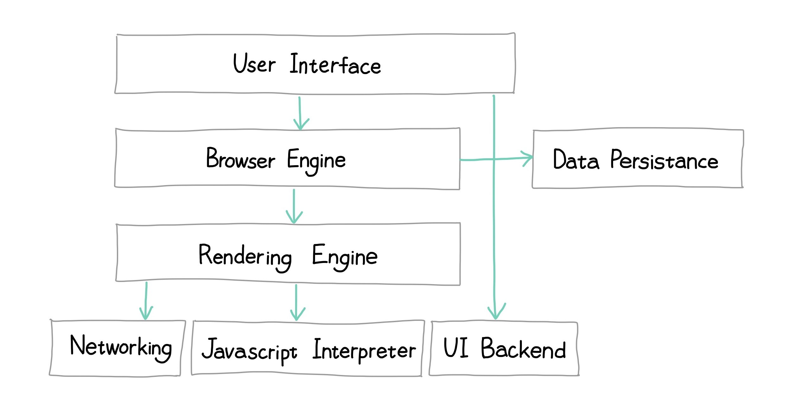

# 브라우저 렌더링

## 브라우저 구조

  

1. User Interface: 웹 페이지를 제외한 사용자와 상호작용하는 부분(예. 주소 표시줄, 이전/다음/새로고침 버튼, 북마크 등)
2. Browser Engine: User Interface와 Rendering Engine 연결
3. Rendering Engine: 웹 페이지 표시
4. Networking: 네트워크 요청 수행
5. Javascript Interpreter: Javascript코드 실행
6. UI Backend: 체크박스나 버튼 같은 기본적인 위젯을 그려줌
7. Data Persistance: 보조 기억장치(예. localStorage, Cookie 등)에 데이터 저장

## 브라우저 렌더링 과정

### 파일 가져오기

- html, css, js, 이미지, 폰트 등의 파일 요청 후 응답받음
  - 외부 요소를 로드하는 태그: `<link>`, ``, `<script>`
- HTTP: 웹에서 브라우저와 서버가 통신하기 위한 프로토콜(규약)
  - HTTP 1.1: 커넥션 하나 당 하나의 요청과 응답만 처리가능, 1999년 발표
  - HTTP 2.0: 다중 응답 처리 가능, 2015년 발표

### 렌더트리 생성

- 렌더링 엔진이 HTML과 CSS를 파싱하여 **DOM**과 **CSSOM**을 생성하고 이들을 결합하여 **렌더트리**를 생성함
  - 렌더링 엔진 종류
    - Blink(크롬, 엣지, 오페라, 삼성인터넷, 웨일)
    - Webkit(사파리, IOS의 크롬)
    - Gecko(파이어폭스)
- 바이트 -> 문자 -> 토큰 -> 노드 -> DOM(Document Object Model)
  - CSS도 동일한 과정으로 파싱됨
    - CSSOM은  CSS의 상속을 반영하여 생성됨
  - 바이트: 서버가 요청받은 HTML 파일을 메모리에 올리고 메모리에 올라간 바이트(2진수)를 보냄
  - 문자: meta 태그의 charset에 지정된 인코딩방식(예. UTF-8) 기준으로 문자열로 변경
  - 토큰: 문법적 의미를 갖는 코드의 최소 단위
  - 노드: 각 토큰을 객체로 변환하여 생성됨. 문서 노드, 요소 노드, 어트리뷰트 노드, 텍스트 노드
  - DOM: 노드로 구성된 트리 자료구조, HTML문서를 파싱한 결과물
- 렌더트리
  - 화면에 표시되어야하는 모든 노드의 컨텐츠, 스타일 정보를 포함
  - 화면에 렌더링되지 않는 노드(예. meta, script)는 미포함
  - `display: none`인 노드는 미포함

### JS 실행

- 자바스크립트를 파싱하여 AST(Abscract Syntax Tree)를 생성하고 바이트코드로 변환하여 실행
- JS는 DOM API를 통해 DOM, CSSOM을 변경할 수 있으며, 변경된 DOM, CSSOM은 다시 렌더트리로 결합됨
- JS파싱은 브라우저 렌더링 엔진이 아닌 자바스크립트 엔진이 처리함
  - JS엔진이 AST를 생성하고 이를 기반으로 인터프리터가 실행할 수 있는 바이트 코드를 생성하여 실행
    - 토크나이징: 단순 문자열인 코드를 어휘 분석하여 문법적 의미를 갖는 코드의 최소단위 토큰으로 분해
    - 파싱: 토큰의 집합을 구문 분석하여 AST(토큰에 문법적 의미와 구조를 반영한 트리) 생성, AST는 인터프리터 컴파일러 뿐 아니라 TypeScript, Babel Prettier같은 트랜스파일러를 구현하는데 사용 가능함
    - 바이트코드의 생성과 실행(인터프리터에 의해 생성됨)\
 - 자바스크립트 엔진 종류
   - V8(크롬, 엣지, Node.js)
   - SpiderMonkey(파이어폭스)
   - JavaScriptCore(사파리)

### 렌더트리 기준으로 레이아웃 계산 후 페인팅

- 렌더링 엔진은 빠르게 내용을 표시하기 위해 HTML파싱 완료를 기다리지 않고 레이아웃과 페인팅 과정을 시작함
- 레이아웃(리플로우)
  - 뷰포트 내 요소들의 크기와 위치 계산
  - `%`나 `em`과 같은 상대적인 단위가 `px`로 변경됨
- 페인팅
  - 화면에 실제 픽셀로 그려짐
- 리플로우와 리페인팅이 일어나는 동작
  - JS에 의한 노드 추가, 삭제
  - 브라우저 창 리사이징에 의한 뷰포트 크기 변경
  - HTML 레이아웃을 변경시키는 스타일 변경
    - width/height, margin, padding, border, display, position, top/right/bottom/left 등
    - 레이아웃에 영향이 없는 변경은 리플로우없이 리페인팅만 실행되기도 함

## script 태그의 위치

- 하단!
  - 렌더링 엔지과 자바스크립트 엔진은 직렬적으로 파싱을 수행한다. script태그의 위치에 따라 HTML 파싱이 블로킹되어 DOM생성이 지연될 수 있다.
  - JS에서 아직 생성되지 않은 DOM을 조작하려고하면 문제가 발생할 수 있다.

### `async` / `defer`

- src 어트리뷰트로 외부 JS파일을 로드하는 경우에만 사용 가능
- async
  - 의존성이 없는 스크립트
  - HTML 파싱과 자바스크립트 파일 로드가 동시에 진행됨.
  - 자바스크립트 파일의 로드가 완료되면 자바스크립트의 파싱과 실행이 시작되고 HTML파싱 중단
  - 여러 scirpt태그에 적용 시 먼저 로그가 완료된 파일부터 실행하므로 순서가 보장되지 않음
- defer
  - DOM 제어와 관련있는 스크립트
  - HTML 파싱과 자바스크립트 파일 로드가 동시에 진행됨.
  - 자바스크립트의 파싱과 실행은 DOM 생성이 완료된 직후

## 성능 향상을 위한 방법

- 리플로우와 리페인트를 발생시키지 않는 애니메이션 사용하기
- JS, CSS 파일들을 하나로 묶기
- 여러 이미지를 하나로 묶기([CSS Sprite](https://www.w3schools.com/css/css_image_sprites.asp))
- 초기 로딩 시 필요없는 JS나 뷰 포트 밖의 이미지는 삭제하거나 추후로 로딩 미루기(lazy loading)
- 브라우저 당 동시 연결가능한 개수가 정해져 있다. 많은 요청을 보내면 기다려야함
    - HTTP2 사용하기
- 파일 크기 줄이기
  - CSS, JS
    - 주석제거
    - 공백제거
    - 난독화
    - 압축
  - 이미지 크기 줄이기
    - 포맷에 따라 용량 다르기 때문에 적절한 포맷 사용
    - 메타정보 제거
- Preload 미리 자원을 가져오기
- head태그의 자원은 병렬로 받기 때문에 꼭 필요한 CSS와 JS만 넣기
  - head태그의 자원을 모두 로드하기 전까지 빈 화면이 나타남
- js는 body태그 마지막에
- Hero 엘리먼트는 lazy하게 처리하면 안됨, 가장 먼저 보여야하는 컨텐츠
- 실질적인 성능향상은 아니지만, 사용자 체감 속도를 줄이기 위한 스켈레톤 UI 사용

## 참고

- 모던 자바스크립트 Deep Dive, 38장 브라우저 렌더링 과정
- [브라우저는 어떻게 동작하는가? - NAVER D2](https://d2.naver.com/helloworld/59361)
- [TECH CONCERT: FRONT END 2019 - 오늘부터 나도 FE 성능분석가](https://www.youtube.com/watch?v=cpE1dwJgS4c&list=RDCMUCNrehnUq7Il-J7HQxrzp7CA&index=2)
- [[10분 테코톡] ☕️ 체프의 브라우저 렌더링](https://www.youtube.com/watch?v=sJ14cWjrNis&t=1s)

---

[[TOP]](#브라우저-렌더링) | [[HOME]](https://github.com/SunYoungKwon/Sun-Woowa.log#-what-i-studied-in-woowacourse)
